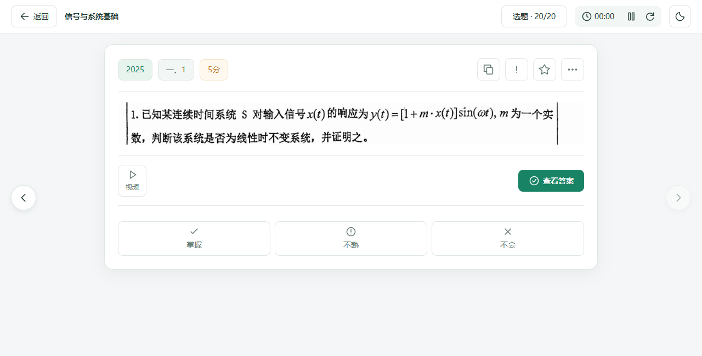

# 浙大 842 刷题

一个在自己电脑上使用的专业课题库，整理了 **2009—2025 年浙大 842 真题**。可以按章节练习，也可以按年份做整卷；收藏、个人答案和每轮练习记录都保存在本机。

**Windows / macOS · 解压即用 · 离线刷题**

[下载最新版](https://github.com/burriedalien666/zju842-practice/releases/latest) · [使用指南](docs/local-guide.md) · [更新日志](CHANGELOG.md) · [问题反馈](https://github.com/burriedalien666/zju842-practice/issues)



## 开始使用

| 你的电脑        | 下载                                                                                                                     |
| --------------- | ------------------------------------------------------------------------------------------------------------------------ |
| Windows x64     | [Windows 版](https://github.com/burriedalien666/zju842-practice/releases/download/v0.5.7/zju842-0.5.7-windows-x64.zip)   |
| Mac，Apple 芯片 | [Mac arm64 版](https://github.com/burriedalien666/zju842-practice/releases/download/v0.5.7/zju842-0.5.7-macos-arm64.zip) |
| Mac，Intel 芯片 | [Mac Intel 版](https://github.com/burriedalien666/zju842-practice/releases/download/v0.5.7/zju842-0.5.7-macos-x64.zip)   |

1. 下载对应版本，完整解压到一个文件夹。
2. Windows 双击 `启动题库.cmd`；Mac 双击 `启动题库.command`。
3. 在自动打开的浏览器里开始做题。使用期间保留启动窗口，关闭它会结束本地服务。

不需要安装 Node.js 或 Docker。GitHub 的 **Source code** 是开发用源码，日常使用请下载上表中的完整包。

已经安装的用户，可以在程序的“更新中心”检查更新。首次启动、迁移资料和连接问题见[使用指南](docs/local-guide.md)。

## 按自己的节奏练习

- **按章节选题**：信号与系统、数字电路分别组织，支持题型、年份、题源和关键词筛选。
- **一题一题做**：左右切题、题号跳转，答案按需展开；支持日夜模式，题图可以查看完整内容。
- **留下自己的答案**：导入答案照片，调整顺序、旋转、替换，再整理成定稿。个人答案与公共参考答案分开保存。
- **记录每一轮**：整卷计时、自评和历史回看；重新做一轮不会覆盖上一轮。
- **整理重点题**：用星星收藏，或加入自己的题单；自评区分“掌握、不熟、不会”，刚才的误操作可以撤销。
- **查看历年考点**：按章节、知识点和年份查看命题分布，点击统计项回到题目。

这里不自动判卷。完成进度表示做过多少题，自评表示你对这道题的判断。

## 题库与后续内容

当前包含 **469 条题目、287 张原题图**，涵盖信号与系统、数字电路。题面目前仍使用原卷图像，过大的边缘留白会自动收起，原图可随时查看。

公开题库暂未附公共答案和正式视频讲解，你可以先导入自己的答案照片。作者整理后的公共答案、题目和讲解链接，会通过更新中心陆续提供。

接下来的内容工程是将题面逐步转为文字、公式和可缩放绘图。目前只制定[迁移计划](docs/structured-questions-plan.md)，尚未开始全库转换。

## 资料保存在这里

个人数据位于程序文件夹中的 `userdata`。在“资料与备份”里可以导出完整备份，换电脑或升级前也可以留一份。

程序、题库和公共答案分别更新。公共资料更新不会替换你的个人答案、收藏和题单；定稿个人答案也不会自动公开。已有内容可离线使用，下载更新和打开B站视频需要联网。

## 反馈与维护

发现题图缺失、分类不合适或程序问题，欢迎[提交反馈](https://github.com/burriedalien666/zju842-practice/issues)，附上题号、程序版本和截图即可。不要把私人备份或整个 `userdata` 上传到公开仓库。

- [使用与备份](docs/local-guide.md)
- [公开答案如何发布](docs/publishing-answers.md)
- [题库维护与期末题追加](docs/questions.md)
- [视频链接维护](docs/video-guide.md)
- [后续计划](docs/roadmap.md)

## 从源码运行

需要 Node.js 24.14 或更新的 24.x 版本：

```sh
npm ci
npm run build
npm run desktop
```

本地启动器只监听本机地址，不读取云端配置。开发、测试和打包说明见[更新发布维护](docs/updates-maintenance.md)；自托管说明见[部署文档](docs/deployment.md)。

## 许可

程序代码及技术文档采用 [MIT 许可证](LICENSE)。试题、题图与答案素材不属于代码许可证的授权范围，见[素材说明](CONTENT-NOTICE.md)。
